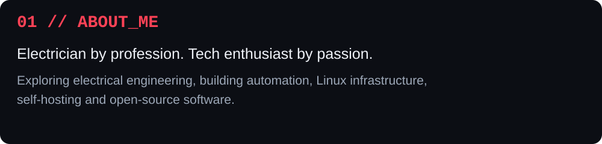
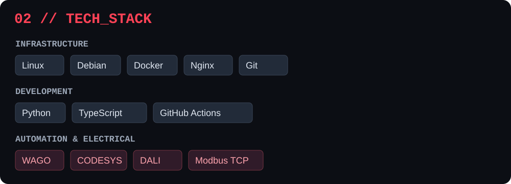
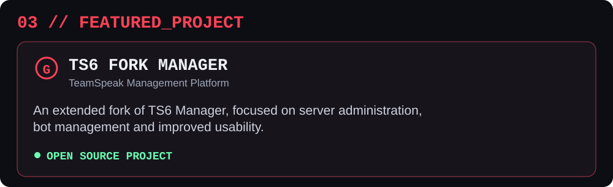
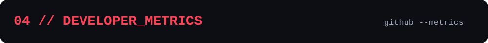
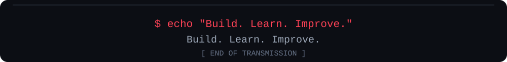

<!-- The GitHub Actions workflow generates this file after its first successful run and PR merge. -->

Metrics reflect GitHub activity, not professional skill level. The chart is available after the initial workflow run and merge.

